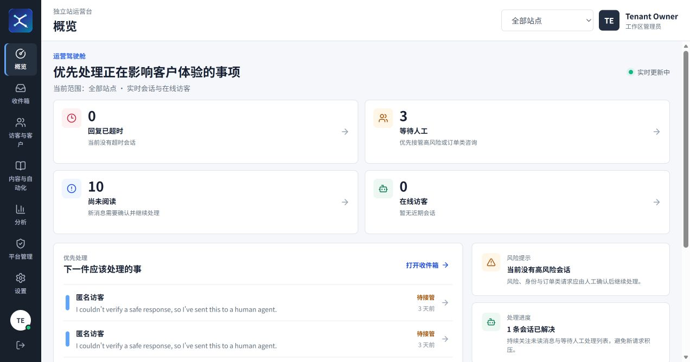
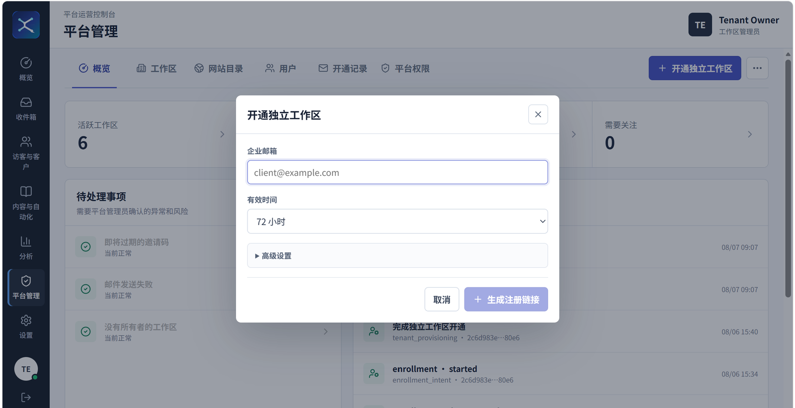
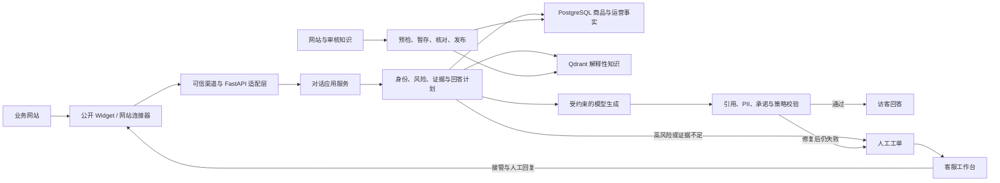

<p align="center">
  
</p>

<h1 align="center">SupportOS</h1>

<p align="center">
  <strong>不是把知识库简单接给模型，而是把模型放进一套可控、可审计的客服系统。</strong>
</p>

<p align="center">
  面向多租户网站客服，覆盖访客接入、商品问答、知识发布、风险控制、转人工、客服工作台和生产运维。
</p>

<p align="center">
  
  
  
  <a href="https://github.com/paulrose4/supportos-ai-customer-support-platform/actions/workflows/quality-gates.yml"></a>
  <a href="https://livechatgo.com/"></a>
</p>

<p align="center">
  <a href="https://livechatgo.com/"><strong>查看线上产品界面</strong></a>
  &nbsp;·&nbsp;
  <a href="#快速开始">快速开始</a>
  &nbsp;·&nbsp;
  <a href="docs/architecture.md">系统架构</a>
  &nbsp;·&nbsp;
  <a href="docs/engineering-case-study.zh-CN.md">工程案例</a>
  &nbsp;·&nbsp;
  <a href="docs/public-release-provenance.zh-CN.md">公开发布说明</a>
  &nbsp;·&nbsp;
  <a href="docs/server-deployment-guide.zh-CN.md">生产部署指南</a>
</p>

<p align="center">
  
</p>

<p align="center">
  <sub>线上工作台界面。公开截图已脱敏，不含敏感垂直业务内容、客户 PII 或私有运营数据；图中数值仅用于展示产品状态与信息架构，不作为公开业务成果指标。</sub>
</p>

## 一句话理解

SupportOS 是部署在 [LiveChatGo](https://livechatgo.com/) 上的多租户智能客服平台，由三部分组成：

这是公司内部核心项目，于 2026 年 7 月中旬启动。项目在职期间的需求分析、产品建模、架构设计、
Agent/RAG、前后端实现、测试、部署上线与迭代维护均由我独立负责，并结合客服和运营人员的业务反馈持续调整。
平台已接入约 10 个多品类独立站，并按 6 个真实业务工作区管理与隔离，主要供企业内部客服与运营团队使用。

1. 面向访客的公开聊天组件和网站连接器。
2. 由确定性规则约束的 AI 客服运行时。
3. 面向人工客服和管理员的运营工作台。

> [!NOTE]
> 本仓库为经公司明确授权公开的真实业务项目源码。为避免原始提交历史中的客户信息、内部配置、
> 运营数据和个人材料泄露，公开仓库从经过安全审计的代码快照重新建立，因此公开提交数量不代表完整开发周期。
> 公开内容不包含真实客户 PII、密钥或私有运营数据；示例域名、SKU、商品、政策和 Eval 检索语料均为合成数据。
> 详细边界见[公开发布与项目溯源说明](docs/public-release-provenance.zh-CN.md)。

<details>
<summary><strong>企业内部工作区邀请码准入</strong></summary>

<p align="center">
  
</p>

平台管理员为指定企业邮箱生成一次性注册链接，并配置有效期与站点额度。工作区、Owner 身份和可信权限均由服务端创建，链接支持过期、撤销、防重放与审计。
</details>

它的核心价值不是“让模型回答更多”，而是让系统知道什么时候可以回答、答案必须来自哪里，
以及什么时候必须停止自动化并把会话交给人工。

> [!IMPORTANT]
> **模型只负责理解和组织语言。身份、租户、权限、风险、商品事实、知识发布、引用、转人工和
> 不可逆操作策略全部由确定性代码决定。**

## 可验证工程证据

下面的数字来自当前仓库和可重复执行的质量命令，不把代码规模等同于业务效果：

| 证据 | 当前基线 |
| --- | --- |
| Python 自动化测试 | 默认环境 751 项通过；另有 55 项 PostgreSQL、Qdrant、Redis 集成用例在目标环境执行 |
| 业务覆盖 | 接入约 10 个多品类独立站，按 6 个真实业务工作区管理与隔离，服务客服与运营团队 |
| 固定离线回归 | 30 条版本化输出合同用例全部通过，覆盖引用、拒答、风险升级、业务承诺与跨租户安全 |
| 前端质量 | React/Vite Dashboard 具备 Vitest 测试与 TypeScript 生产构建，二者均进入 CI |
| 架构约束 | 6/6 AST 契约测试通过，阻止框架、ORM、向量库和供应商 SDK 反向污染领域/应用层 |

Recall@10、真实模型输出评测、延迟、成本和运营指标必须绑定当前
commit、数据集哈希与目标环境重新运行。仓库不会把过期报告或跳过的测试包装成通过结果。
完整证据、技术取舍与边界见[工程案例](docs/engineering-case-study.zh-CN.md)。

## 项目真正的优势

### 1. 精确事实与语义知识分源治理

普通 RAG 容易把“相似内容”误当成“准确事实”。SupportOS 将两类数据明确分开：

- PostgreSQL 保存商品 URL、SKU、MPN、价格快照、库存快照、材质、尺寸、重量和配送区域。
- Qdrant 保存 FAQ、政策、购买指南、商品说明等可重建的解释性知识。
- 精确商品引用匹配失败时，不会用向量检索出的相似商品代替。
- 价格、库存和商品规格都有独立时效规则，过期数据不会被包装成实时事实。

因此，向量检索负责“帮助解释”，数据库负责“决定事实”。

### 2. 风险判断发生在模型之前

订单、退款、取消、支付、地址修改、赔偿和高风险产品使用请求会在调用模型或业务工具前被拦截。
模型不能降低风险等级，也不能通过提示词绕过规则。

回答生成后还会再次进行确定性校验，包括：

- 证据和引用是否匹配；
- 是否泄露 PII 或跨租户信息；
- 是否出现未经支持的数字、链接或业务承诺；
- 产品使用与维护步骤是否来自已审核 SOP；
- 输出语言和可见链接是否符合当前站点要求。

允许修复的表达问题最多重写一次，再次失败就转人工。

### 3. AI 与人工客服是同一个业务闭环

这不是只有聊天接口的 Agent Demo。系统包含真实的客服运营控制面：

- 统一收件箱、人工接管、释放、回复、备注、路由和解决会话；
- 人工工单、支持队列、成员分配、快捷回复和 SLA 排序；
- 访客在线状态、当前页面、离线留言和满意度评价；
- 客户目录、会话历史、可信身份和经同意保存的客户记忆；
- 运营报表、知识缺口、审计日志、登录会话和备份状态。

一旦会话进入人工队列或被客服接管，后续访客消息不会让 AI 自动抢回处理权。

### 4. 多租户安全不是一个查询条件

租户隔离由多层防线共同保证：

- 身份和 `tenant_id` 只来自可信认证或站点适配器；
- 应用服务执行权限和资源归属检查；
- Repository 查询显式携带租户上下文；
- PostgreSQL 使用受限角色和 Row-Level Security；
- Qdrant 查询强制添加租户、站点、受众、语言和发布状态过滤；
- 检索结果返回后再次验证 Payload 不变量。

用户消息、URL 参数或模型输出都不能决定自己属于哪个租户。

### 5. 网站知识发布考虑了真实故障

网站内容不是抓取后直接覆盖线上索引。生产同步链路包含：

- Sitemap 发现、robots.txt、SSRF 防护和压缩炸弹限制；
- 正文提取、导航噪声过滤、Canonical 处理和近重复去重；
- 商品 JSON-LD 解析和 PostgreSQL 商品快照暂存；
- 持久化任务、Worker Lease、Checkpoint、取消和重试；
- Qdrant 非活动版本写入、数量核对、发布切换和失败恢复；
- 缺失商品的两阶段过期策略，避免一次抓取异常导致商品立即消失。

旧版本只有在新版本通过核对后才会被替换。

### 6. 生产约束是可执行门禁

项目不仅提供部署文档，还把关键要求写进了代码和 CI：

- 架构测试阻止领域层和应用层导入 Web 框架、ORM、向量库或供应商 SDK；
- 生产配置拒绝 Fake Model、Mock 身份、不安全 Cookie、宽松 Origin 和占位密钥；
- 单元、契约、集成、检索和安全评测覆盖主要风险路径；
- Alembic、备份校验、恢复流程、Prometheus 指标和发布脚本形成运维基线；
- 写操作普遍使用幂等键、唯一约束、状态锁和审计记录。

## 系统闭环



## 当前产品能力

| 产品面 | 主要能力 |
| --- | --- |
| 访客端 | Widget 初始化、会话恢复、流式事件、在线状态、离线留言、营业时间和 CSAT |
| AI 运行时 | 意图理解、风险路由、商品问答、混合检索、销售计划、引用验证和人工升级 |
| 客服工作台 | Inbox、Visitors、Tickets、Knowledge、Automation、Customers、Reports 和 Settings |
| 站点接入 | 一行公开 Widget 代码、WordPress 插件、静态/PHP 连接器和 Origin 验证 |
| 身份权限 | 邮箱登录、邀请注册、工作区切换、RBAC、会话撤销、密码恢复和钉钉 SSO |
| 平台治理 | 多租户、站点管理、平台用户、成员关系、审计、数据保留和安全状态 |
| 运维能力 | PostgreSQL、Qdrant、Redis、Caddy、Prometheus、备份恢复和生产校验 |

## 自动化边界

| 可以自动处理 | 必须追问或转人工 |
| --- | --- |
| 有证据支持的 FAQ、政策和商品咨询 | 订单状态与物流查询 |
| 精确商品规格和带日期的价格、库存快照 | 退款、取消、支付和赔偿 |
| 从当前商品目录筛选出的推荐和比较 | 地址、履约和隐私操作 |
| 已审核且适用于当前商品的使用与维护 SOP | 涉及人身安全、复杂维修或异常损坏等高风险问题 |
| 可信身份下的本人客服工单只读查询 | 证据缺失、过期、冲突、越权或输出校验失败 |

系统没有注册执行退款、取消订单、支付、隐私删除或其他不可逆业务操作的工具。详细规则参见
[风险矩阵](docs/risk_matrix.md)和[订单强制转人工策略](docs/order-human-handoff-policy.md)。

## 知识来源：当前实际情况

| 来源 | 当前作用 |
| --- | --- |
| 网站同步 | 租户业务知识的主要入口，负责 FAQ、政策、商品说明和结构化商品抽取 |
| PostgreSQL 商品快照 | 精确商品身份和结构化事实的唯一权威来源 |
| 全局审核 Markdown | 跨租户公司政策、通用说明和经过人工审核的产品知识 |
| Markdown/Obsidian Vault | 可选导入能力，用于扫描带 Frontmatter 和 `[[双向链接]]` 的 Markdown 目录 |

> [!NOTE]
> 项目不依赖 Obsidian 客户端、Obsidian 插件或 Obsidian Sync。所谓 Obsidian Vault 接入，本质是
> 对兼容 Obsidian 格式的 Markdown 目录进行扫描、校验、切块和索引。当前生产部署默认挂载全局
> 审核 Markdown，租户知识的主要生产链路是网站同步和商品快照。

相关文档：

- [知识来源与发布规则](docs/knowledge-sources.md)
- [混合检索设计](docs/hybrid-retrieval.md)
- [网站知识抓取器](docs/web-knowledge-crawler.md)
- [网站同步运维](docs/web-knowledge-operations.md)
- [商品快照运行机制](docs/product-snapshot-runtime.md)
- [本地 Embedding](docs/local-embeddings.md)

## 快速开始

### 环境要求

- Git
- Docker Engine 或 Docker Desktop
- Docker Compose v2
- 完整开发栈建议预留至少 8 GB 可用内存

### 1. 克隆并创建配置

```bash
git clone https://github.com/paulrose4/supportos-ai-customer-support-platform.git
cd supportos-ai-customer-support-platform
```

macOS 或 Linux：

```bash
cp .env.example .env
```

Windows PowerShell：

```powershell
Copy-Item .env.example .env
```

在未提交的 `.env` 中设置本地管理员：

```dotenv
BOOTSTRAP_ADMIN_EMAIL=admin@example.test
BOOTSTRAP_ADMIN_PASSWORD=replace-with-a-local-password
```

### 2. 启动开发栈

```bash
docker compose up --build -d
docker compose exec api alembic upgrade head
```

| 服务 | 地址 |
| --- | --- |
| 客服工作台 | <http://localhost:8090> |
| OpenAPI 文档 | <http://localhost:8000/docs> |
| API 就绪检查 | <http://localhost:8000/health/ready> |
| PostgreSQL | `localhost:5432` |
| Qdrant | `localhost:6333` |
| Redis | `localhost:6379` |

验证：

```bash
curl --fail http://127.0.0.1:8000/health/ready
```

Windows PowerShell 使用：

```powershell
curl.exe --fail http://127.0.0.1:8000/health/ready
```

开发配置默认使用内置伪模型，不会调用外部 AI 服务。网站正式发布、SMTP、数据保留执行和
全局知识同步默认关闭。

### 3. 启用网站同步 Worker

```bash
docker compose --profile web-sync up -d web-sync-worker
```

<details>
<summary><strong>本机运行 API 和 Dashboard</strong></summary>

先启动基础设施：

```bash
docker compose up -d postgres qdrant redis
```

Python API：

```bash
python3.12 -m venv .venv
source .venv/bin/activate
python -m pip install -e ".[dev]"
alembic upgrade head
uvicorn app.main:app --reload
```

Windows 使用 `.venv\Scripts\Activate.ps1` 激活虚拟环境。

Dashboard：

```bash
cd dashboard
npm ci
npm run dev
```

</details>

<details>
<summary><strong>构建 WordPress 和静态站点连接器</strong></summary>

```bash
python scripts/build_wordpress_plugin.py
python scripts/build_site_connectors.py
```

安装包输出到 `dist/`，构建不会部署或修改网站。

- [公开 Widget 生产设计](docs/public-widget-production.md)
- [网站连接器](docs/site-connectors.md)
- [WordPress 插件](docs/wordpress-plugin.md)

</details>

## 架构边界

| 目录 | 职责 |
| --- | --- |
| `app/domain` | 领域模型、端口和确定性业务规则 |
| `app/application` | 用例 DTO、权限检查、幂等控制和应用服务 |
| `app/graphs` | LangGraph 状态、节点和受控路由 |
| `app/api` | HTTP/WebSocket Schema、可信身份映射和错误转换 |
| `app/integrations` | PostgreSQL、Qdrant、Redis、SMTP、认证和模型适配器 |
| `app/knowledge` | Markdown 导入和与框架无关的网站知识处理 |
| `app/bootstrap` | 组合根和依赖装配 |
| `dashboard` | 独立 React/Vite 客服工作台 |

仓库强制遵守以下依赖方向：

- 领域层和应用层不导入 FastAPI、LangGraph、SQLAlchemy、Qdrant 或供应商 SDK。
- API、图节点和工具只调用应用服务，不能直接访问 Repository 或 SDK Client。
- 基础设施模型不能成为领域模型、API 响应或 LangGraph 状态。
- 所有关键查询和写入都必须携带可信租户上下文。
- 业务、安全和发布决策不能只依靠 Prompt。

参见[系统架构](docs/architecture.md)、[安全设计](docs/security.md)、
[项目假设](docs/assumptions.md)和[客服运营边界](docs/support-operations.md)。

## API 与工作台

完整接口可在 <http://localhost:8000/docs> 查看。主要分组包括：

- `/v1/public-widget/*`：公开 Widget 初始化、对话、在线状态、事件、满意度和离线留言；
- `/v1/auth/*`：登录、邀请、密码恢复、工作区切换和会话管理；
- `/v1/admin/*`：收件箱、会话、站点、客户、报表、审计和系统状态；
- `/v1/knowledge/*`：知识就绪、Markdown 同步、网站预检、任务和发布；
- `/v1/platform/*`：平台租户、站点、用户、成员关系和角色；
- `/v1/ws/support`：租户范围内的客服实时事件。

工作台提供 `/inbox`、`/visitors`、`/tickets`、`/knowledge`、`/automation`、`/customers`、
`/reports` 和 `/settings` 等实际业务页面，并根据管理员权限控制导航和操作。

## 开发与质量门禁

Python：

```bash
python -m ruff check .
python -m ruff format --check .
python scripts/check_architecture.py
python -m pytest
```

Dashboard：

```bash
cd dashboard
npm ci
npm test
npm run build
```

发布评测：

```bash
python -m evals.run_production_gate
python -m pytest tests/evals -q
```

`tests/integration` 需要独立 PostgreSQL、Qdrant、Redis 和对应环境变量。默认 `pytest` 通过时，
如果真实基础设施测试被跳过，不能将结果理解为全部外部适配器已经完成本轮验收。

## 生产部署

仓库提供单机生产基线：Caddy 负责 HTTPS，Dashboard、API、PostgreSQL、Qdrant、Redis 和 Worker
通过 Docker Compose 管理，数据服务不直接暴露公网。

```bash
cp .env.production.example .env.production
sh ./scripts/deploy.sh
```

Windows 预演：

```powershell
Copy-Item .env.production.example .env.production
pwsh -File scripts/deploy.ps1 -EnvFile .env.production
```

> [!CAUTION]
> 当前方案是受控的单机生产基线，不等于多地域高可用平台。真实模型、SMTP、SSO、备份恢复、
> 容量和故障演练必须在目标环境单独验收。

- [生产部署说明](docs/deployment.md)
- [中文生产部署指南](docs/server-deployment-guide.zh-CN.md)
- [备份与恢复](docs/backup-and-restore.md)
- [运营就绪检查](docs/operations-readiness.md)
- [容量与发布手册](docs/presence-capacity-runbook.zh-CN.md)
- [企业级质量门禁](docs/enterprise-quality-gates.md)

## 文档导航

| 主题 | 文档 |
| --- | --- |
| 工程案例 | [SupportOS 工程案例](docs/engineering-case-study.zh-CN.md) |
| 公开发布 | [项目溯源与公开边界](docs/public-release-provenance.zh-CN.md)、[公开变更记录](CHANGELOG.md) |
| 项目全貌 | [项目深度解读](docs/current-project-deep-dive.zh-CN.md)、[面向管理者的项目说明](docs/boss-project-explanation.zh-CN.md) |
| 架构与风险 | [系统架构](docs/architecture.md)、[安全设计](docs/security.md)、[风险矩阵](docs/risk_matrix.md) |
| 身份与租户 | [管理员认证](docs/admin-authentication.md)、[邮箱邀请](docs/email-invitation-auth.md)、[数据库角色与 RLS](docs/database-roles-and-rls.md) |
| 知识系统 | [知识来源](docs/knowledge-sources.md)、[混合检索](docs/hybrid-retrieval.md)、[网站同步运维](docs/web-knowledge-operations.md) |
| 客服体验 | [客服运营](docs/support-operations.md)、[实时事件](docs/realtime.md)、[公开 Widget](docs/public-widget-production.md) |
| 部署运维 | [生产部署](docs/deployment.md)、[中文部署指南](docs/server-deployment-guide.zh-CN.md)、[备份恢复](docs/backup-and-restore.md) |

## 当前状态

SupportOS 已经是一套上线运行、规则约束较强并具备人工运营闭环的企业内部系统，而不再只是
Obsidian RAG 原型。当前采用受控单机部署基线，仍需准确理解它的边界：

- 当前生产目标主要是售前商品指导、FAQ、政策和受控的产品使用与维护回答；
- 精确商品事实来自 PostgreSQL 快照，解释性知识来自网站同步和审核内容；
- Markdown/Obsidian 导入是可选能力，不是生产系统必须依赖的软件；
- 订单、退款、支付和其他不可逆业务操作仍然由人工处理；
- 单机部署仍是单一故障域，横向扩展和数据服务高可用需要额外建设；
- 所有生产变更都应经过代码、架构、评测、迁移、安全和运维门禁。

**这个项目的目标不是让 AI 显得无所不能，而是让 AI 在有证据时可靠回答、在不确定时明确停下，
并让人工客服始终拥有最终控制权。**
