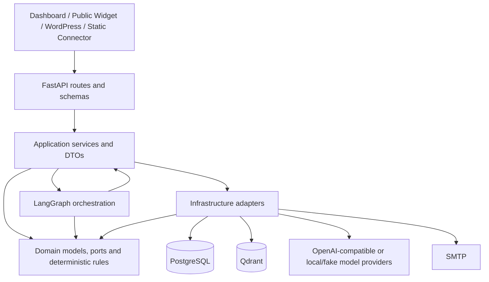
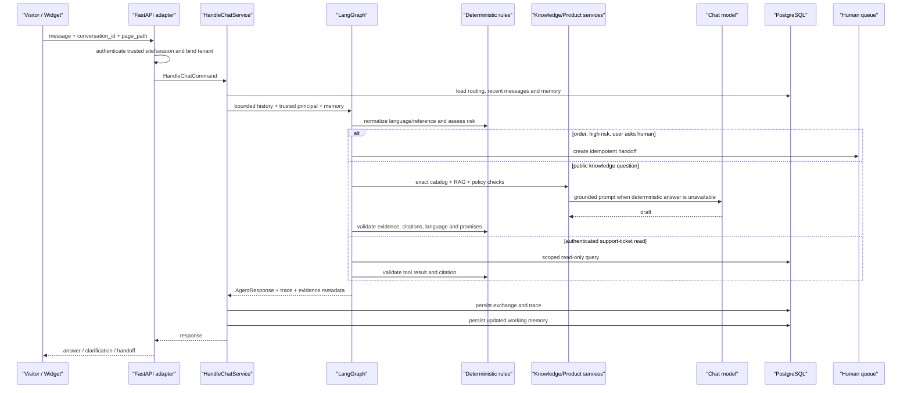
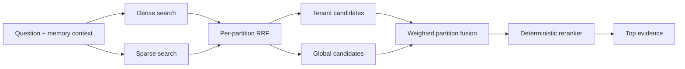
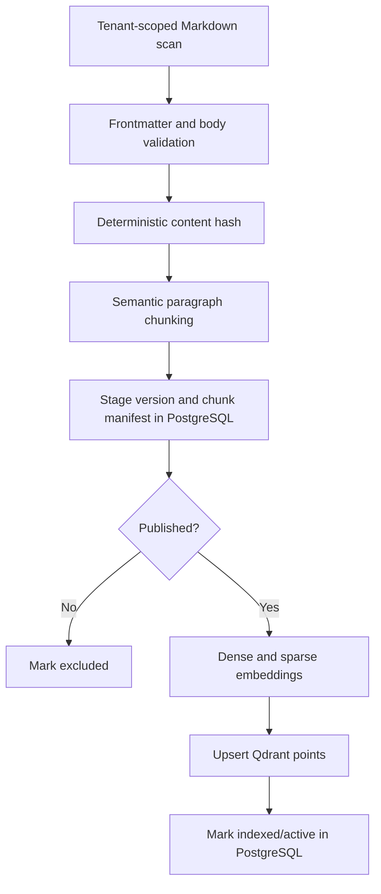
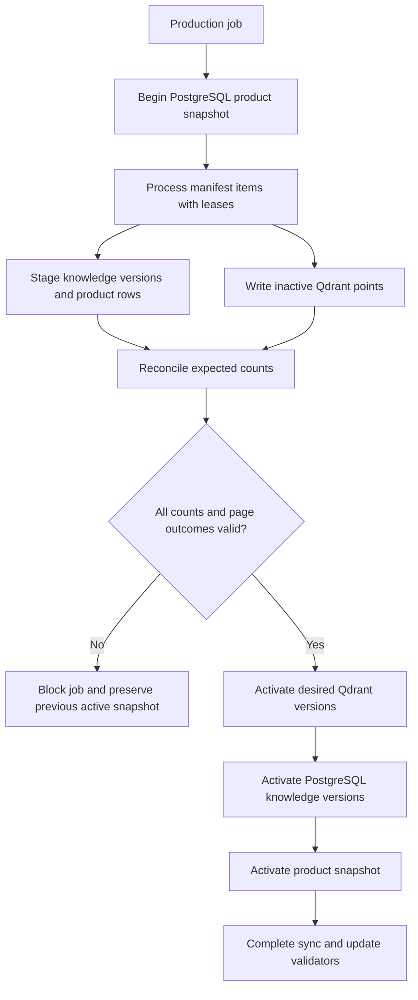

# 当前项目深度解读

> 分析日期：2026-08-10
> 分析对象：当前项目工作区，而不是仅分析 Git `HEAD`

## 1. 执行摘要

这个仓库虽然仍沿用 `Obsidian Customer Support Agent` 的名称，但当前形态已经明显超出“Obsidian 文档接入 RAG”的范围。它实际上是一套面向多租户电商客服的完整平台骨架，覆盖：

- 多渠道访客接入与公开 Widget；
- 基于确定性规则和 LangGraph 的客服编排；
- PostgreSQL 商品快照与 Qdrant 混合检索；
- Obsidian 和公开网站两类知识摄取；
- 订单强制转人工、护理 SOP、证据验证和输出修复；
- 会话、人工队列、客服工作台、客户记忆和运营报表；
- 邮箱邀请登录、传统管理员登录、钉钉 SSO 和平台级租户管理；
- PostgreSQL RLS、多数据库角色、审计、备份状态和保留策略；
- React Dashboard、WordPress 插件、静态 PHP 连接器和公共脚本接入；
- 单元测试、契约测试、真实基础设施集成测试和版本化评测门禁。

项目最重要的设计思想不是“让模型回答得更聪明”，而是：

> 将模型限制在语言生成和受约束解释层，把身份、租户、授权、风险、事实来源、护理步骤、订单处理、链接展示、转人工和发布决策都放在确定性代码中。

从工程成熟度看，项目已经具备较强的架构意识和生产安全基线，但还不能简单理解为“开箱即用的水平扩展生产系统”。当前最明显的限制是：

1. 默认配置仍是开发模式、Mock 身份、Fake 模型和 Mock 数据。
2. 实时事件、在线访客、公共 Widget 频控、FAQ 缓存和请求指标都是进程内实现。
3. 生产 Compose 明确限定为单个 API worker。
4. 文档与实现出现较大漂移，部分文档仍描述旧阶段。
5. 网站知识正式发布链路已经采用暂存、核对和切换机制，但 Obsidian 同步仍存在跨 PostgreSQL/Qdrant 的非原子替换窗口。
6. 评测体系结构完整，但默认 `pytest` 会跳过依赖 PostgreSQL/Qdrant 的真实集成测试，静态生产门禁也不是一次真实模型端到端运行。

因此，更准确的定位是：

> 一套功能面较完整、规则约束较强、生产意识成熟，但仍处于“单实例受控部署和持续收敛”阶段的多租户售前客服平台。

## 2. 分析范围与代码规模

### 2.1 当前工作区不是干净基线

分析时工作区相对 `HEAD` 有约 220 个变更条目，其中包括约 132 个已修改文件和 88 个未跟踪条目。仓库只有一个初始导入提交，因此大量当前能力还没有形成清晰的提交历史。

这意味着本文描述的是“磁盘上的当前实现”，而不是 `git show HEAD` 所能代表的旧基线。后续若要让本文成为长期架构资料，建议先建立可追踪的代码基线和变更记录。

### 2.2 规模概览

排除 `.git`、`node_modules`、`dist` 和缓存目录后，仓库大致包含：

| 指标 | 当前数量 |
| --- | ---: |
| Python 文件 | 417 |
| Python 总行数 | 约 63,766 |
| `app/` Python 文件 | 277 |
| `app/` Python 行数 | 约 42,300 |
| FastAPI 路由装饰器 | 98 |
| API Schema 类 | 112 |
| 应用服务类 | 44 |
| Domain Port 协议 | 46 |
| Alembic 迁移 | 26 |
| 测试文件 | 80 |
| 测试函数 | 405 |
| Markdown 文档 | 27 |

后端代码分布约为：

| 区域 | Python 行数 | 主要职责 |
| --- | ---: | --- |
| `app/integrations` | 14,165 | PostgreSQL、Qdrant、模型、认证、SMTP 等适配器 |
| `app/application` | 8,729 | 用例 DTO 和应用服务 |
| `app/domain` | 7,193 | 领域模型、端口、确定性规则 |
| `app/api` | 5,042 | FastAPI 路由、Schema、中间件 |
| `app/knowledge` | 4,613 | Obsidian 与网站知识处理 |
| `app/graphs` | 1,354 | LangGraph 状态、节点和路由 |
| 其他 | 2,204 | 启动、配置、观测、实时和工具包装 |

代码热点已经集中到少数大文件，例如：

- `app/application/services/knowledge.py`：约 2,034 行；
- `app/integrations/postgres/operations.py`：约 1,576 行；
- `app/integrations/postgres/web_sync_jobs.py`：约 1,177 行；
- `app/integrations/postgres/customer_experience.py`：约 1,172 行；
- `app/knowledge/web/sync_service.py`：约 1,115 行；
- `app/graphs/nodes.py`：约 1,009 行；
- `app/integrations/postgres/email_identity.py`：约 955 行；
- `app/integrations/postgres/conversations.py`：约 916 行。

这些文件承载了大量关键不变量，是未来维护成本和回归风险最集中的区域。

## 3. 项目真实边界

### 3.1 当前做什么

当前生产目标主要是：

- 回答公开售前问题、FAQ、商品规格、价格快照、库存快照、配送范围和已发布政策；
- 根据结构化商品目录进行商品推荐和比较；
- 对护理问题执行封闭世界的已审批 SOP；
- 对多语言访客提供有证据约束的销售型回答；
- 在风险、证据不足、冲突、模型失败或订单相关场景中创建人工工单；
- 为人工客服提供收件箱、接管、回复、备注、路由、SLA、记忆和审计工具；
- 通过 Obsidian 或网站快照维护可发布知识。

### 3.2 当前明确不做什么

项目没有注册或实现真实的不可逆业务动作：

- 不取消订单；
- 不发起退款；
- 不修改收货地址；
- 不处理支付；
- 不承诺赔偿；
- 不执行隐私删除；
- 不把客户文本当作身份或租户依据；
- 不允许模型自行选择租户、权限、SLA 或业务事实。

订单状态、物流、退款、取消、地址、支付和履约异常在图的风险节点被提前拦截，统一进入人工处理。虽然仓库保留了订单只读仓储和查询服务，但当前主对话链路会先执行订单转人工规则，因此公开运行时真正可自动查询的个人业务对象主要是可信身份下的支持工单。

## 4. 总体架构

### 4.1 分层关系



实际依赖方向的关键约束是：

- `domain` 不导入 FastAPI、LangGraph、SQLAlchemy、Qdrant 或 OpenAI SDK；
- `application` 不导入 Web 框架和基础设施 SDK；
- `api`、`graphs`、`tools` 不直接导入 `app.integrations`；
- `app/knowledge/web` 也保持框架和 SDK 中立；
- 具体适配器通过组合根注入到应用服务和图节点。

`tests/contract/test_architecture.py` 使用 AST 扫描导入关系，当前 6 项架构契约测试通过。这类检查对防止明显的逆向依赖很有效，但它只检查 import，不会验证所有运行时调用是否都经过理想的应用服务边界。

### 4.2 各目录职责

| 目录 | 职责 |
| --- | --- |
| `app/domain/models` | 框架无关的实体、值对象、状态枚举和返回模型 |
| `app/domain/ports` | PostgreSQL、Qdrant、模型、认证、通知、事件等抽象接口 |
| `app/domain/rules` | 意图、风险、护理、订单、响应、记忆、销售、RBAC 等确定性规则 |
| `app/application/dto` | 用例输入输出，不暴露 FastAPI 或 ORM 类型 |
| `app/application/services` | 权限检查、编排、幂等控制和业务用例 |
| `app/graphs` | LangGraph 状态和节点路由 |
| `app/api` | HTTP/WS 适配、请求验证、Cookie、Origin 和错误映射 |
| `app/integrations/postgres` | SQLAlchemy 模型和 PostgreSQL 仓储实现 |
| `app/integrations/qdrant` | 混合向量检索与知识投影 |
| `app/integrations/llm` | Fake、FastEmbed、OpenAI-compatible 适配器 |
| `app/knowledge` | Markdown 扫描、解析、切块和同步 |
| `app/knowledge/web` | 安全抓取、HTML 解析、商品提取、质量门禁和暂存发布 |
| `app/bootstrap` | Composition Root 和生命周期管理 |
| `dashboard` | React/Vite 客服工作台 |
| `site-connectors` | 静态 PHP、Cloudflare Worker 和共享 Widget 资产 |
| `wordpress-plugin` | WordPress 服务端代理插件 |
| `evals` | 评测数据、评分器和发布门禁 |

### 4.3 Composition Root

`app/bootstrap/container.py` 是整个系统的真实装配中心。它负责：

1. 创建数据库会话管理器；
2. 选择管理员认证模式；
3. 装配邮件、钉钉和平台身份服务；
4. 创建 PostgreSQL 会话、知识、商品、运营、审计和工单适配器；
5. 选择 Fake、FastEmbed 或 OpenAI 模型提供者；
6. 创建 Qdrant 混合检索适配器；
7. 创建 Obsidian 和网站同步服务；
8. 创建 LangGraph 并注入应用服务；
9. 创建公开 Widget 会话、频控、实时事件和访客在线状态服务；
10. 将全部服务挂到 `Container`，由 FastAPI lifespan 注入 `app.state`。

优点是所有具体技术选择集中在一个位置，领域层和应用层不需要知道基础设施类型。代价是 `Container` 已经达到约 500 行，并且暴露了若干具体适配器类型；随着模块继续增长，组合根需要按子系统拆分 builder，避免成为新的全局耦合点。

## 5. 核心对话链路

### 5.1 端到端时序



### 5.2 `HandleChatService` 的职责

`HandleChatService` 是对话用例入口，负责：

- 校验消息和 `page_path`；
- 创建或复用会话 ID；
- 查询会话是否已进入人工队列；
- 人工接管期间阻止 AI 继续回答；
- 识别客户确认“已解决”的消息；
- 只加载最近 8 条原始对话；
- 加载结构化工作记忆、摘要和长期记忆；
- 调用 Agent Runner；
- 对持久化前的用户文本做邮箱、电话和 Bearer Token 脱敏；
- 持久化用户消息、助手消息、运行轨迹、工具执行和证据 ID；
- 在交换落库后保存工作记忆；
- 发布租户范围内的实时事件。

这里有一个很重要的行为：一旦会话处于 `queued` 或 `human`，后续访客消息只进入人工上下文，不再触发模型。人工处理权不会被下一条访客消息意外抢回。

### 5.3 LangGraph 状态

`GraphState` 是一个版本化、JSON 友好的 TypedDict，目前 `state_schema_version=8`。它包含：

- 输入、标准化消息和页面路径；
- 可信 principal 的最小投影；
- 最近对话、结构化记忆和摘要；
- 响应语言和站点身份；
- 风险级别和路由状态；
- 知识证据、业务证据、引用和相关链接；
- Answer Plan、Sales Plan 和 Retrieval Plan；
- 护理 procedure/step ID；
- 工具执行、失败工具、冲突 ID；
- 验证状态、修复次数和模型版本；
- trace ID、handoff ID 和 SLA 策略。

它刻意不放入 ORM 模型、SDK 响应、数据库 Session、Secret 或完整历史。这与仓库的“基础设施模型不得成为图状态”要求一致。

### 5.4 图节点与分支

图只有 7 个节点，但每个节点内部包含较强的确定性策略：

| 节点 | 主要职责 | 可能结果 |
| --- | --- | --- |
| `normalize_input` | 语言解析、站点身份、销售记忆合并、引用续问解析 | 标准化消息或引用澄清 |
| `assess_risk` | 越界请求、歧义、人工请求、订单拦截、最低风险分类 | knowledge / business / handoff / respond |
| `answer_knowledge` | 商品快照、RAG、护理 SOP、模型生成、链接选择 | answer / clarification / handoff |
| `query_business_data` | 可信身份下的只读支持工单查询 | answer / clarification / handoff |
| `validate_response` | PII、引用、证据、语言、域名、承诺和销售表达验证 | respond / rewrite / handoff |
| `repair_response` | 对允许修复的表达问题执行一次模型改写 | 返回验证节点 |
| `handoff_response` | 创建幂等工单和结构化人工上下文 | handoff |

图的关键安全性质：

- 风险判断发生在模型调用之前；
- 订单请求发生在业务工具调用之前；
- 模型不能降低风险等级；
- 输出验证发生在返回访客之前；
- 只允许一次受约束的响应修复；
- 修复失败或第二次不合格会转人工；
- 转人工是终态，不再回到模型。

### 5.5 风险模型

风险级别共有四级：

| 级别 | 含义 | 自动能力 |
| --- | --- | --- |
| 0 `PUBLIC` | 公开商品和政策问题 | 有证据时回答 |
| 1 `AUTHENTICATED_READ` | 可信身份下的只读数据 | 仅查询本人数据 |
| 2 `HIGH_IMPACT_REQUEST` | 退款、取消、地址、赔偿等 | 只创建人工请求 |
| 3 `SEVERE` | 诈骗、泄露、跨租户等 | 立即人工/安全处理 |

订单规则进一步给出队列、优先级和 SLA，例如支付和地址问题通常为 5 分钟，退款和履约问题为 10 分钟，物流和订单状态为 15 分钟。SLA 由规则产生，不由模型生成。

## 6. 回答来源与决策优先级

公开问题并不是直接进入 Qdrant。实际优先级更接近：

1. **PostgreSQL 商品快照**：精确商品身份、SKU、价格、库存快照、材质、尺寸、重量和配送区域；
2. **确定性护理决策**：产品识别、材料匹配、审批状态、procedure ID 和 step ID；
3. **Qdrant 解释性知识**：FAQ、政策、商品描述、购买指南和材料说明；
4. **模型渲染**：只在证据和计划已经准备好之后生成自然语言；
5. **受限通用指导**：只对明确允许的低风险一般性问题开放；
6. **澄清**：缺少产品、SKU、地区或必要字段时只追问一个关键问题；
7. **转人工**：冲突、过期、工具失败、护理 SOP 缺失、高风险或验证失败。

这种顺序避免让向量相似度承担它不适合承担的责任，例如：

- 精确商品 URL 不会被“相似商品”替代；
- 商品推荐候选来自 PostgreSQL，不由模型凭空创建；
- 价格和库存有独立新鲜度窗口；
- 护理动作必须来自已批准 SOP；
- 引用与访客可见链接分离；
- 模型失败时可使用结构化商品快照形成确定性回退。

## 7. 商品快照与销售回答

### 7.1 PostgreSQL 是商品事实源

商品快照包含：

- `tenant_id`、`site_id` 和 `snapshot_id`；
- 商品 key、SKU、MPN、canonical URL；
- 名称、品牌、材质、尺寸、重量；
- 页面价格、货币、页面库存状态；
- 仓库、配送区域；
- ETag、Last-Modified、抓取时间和内容哈希；
- `valid`、`pending_removal`、`expired` 状态。

Qdrant 中虽然也会携带商品身份元数据，但它不是商品事实源。Qdrant 的商品字段主要用于筛选和解释上下文，不负责对精确商品引用做相似替换。

### 7.2 新鲜度规则

默认有效期为：

- 商品规格：30 天；
- 页面价格：7 天；
- 页面库存：7 天。

过期信息不会被描述为实时事实。价格回答会带同步日期和商品链接；库存只被描述为页面抓取时的历史状态，不保证当前库存。

### 7.3 推荐与比较

推荐和比较遵循以下约束：

- 候选从当前活动商品快照中读取；
- 应用层根据预算、材质、排除条件、重量等确定性过滤；
- 最多保留 3 个候选；
- 模型可以解释候选差异，但不能新增 SKU；
- 推荐理由和 trade-off 会进入结构化证据；
- 精确 URL/SKU 查不到时，系统澄清而不是借用相似商品事实。

### 7.4 多语言销售计划

系统在 Answer Plan 之外还生成 Sales Response Plan，内容包括：

- 当前意图和销售阶段；
- 已确认偏好；
- 主要异议；
- 必需证据类型；
- 推荐商品 ID；
- 最多一个后续问题；
- 下一最佳动作；
- 目标语言、称呼方式和正式程度；
- 是否需要首次自我介绍；
- 需要避免的近期重复短语；
- 禁止的绝对承诺和营销表达。

模型负责自然表达，但销售计划本身不携带未经证据支持的事实。

## 8. 对话记忆

项目实现了三层记忆：

### 8.1 最近原始历史

每次只加载最近 8 条消息进入图，限制 prompt 体积和旧消息污染。

### 8.2 会话工作记忆

工作记忆按 `(tenant_id, conversation_id)` 持久化，包含：

- 当前商品和待确认商品；
- 候选商品与标签；
- 国家、货币、已确认字段和缺失字段；
- 上次意图和未解决问题；
- 主要目标、偏好事实和异议；
- 销售阶段、下一动作和问题台账；
- 最近回答短语和修订号。

只有从客户文本中确定性提取的事实才能被标记为 confirmed。模型推断不会直接写成已确认偏好。

### 8.3 长期客户记忆

长期记忆只对可信客户身份开放，并要求同意状态。支持：

- 偏好；
- 已验证商品；
- 排障记录；
- 已确认解决方案。

此外还有 `memory_candidates` 审核流和 `resolution_episodes`，用于把潜在记忆与真正可复用记忆分开。匿名访客不能通过文本建立跨会话身份，也不能创建跨站点长期记忆。

## 9. 护理 SOP：封闭世界策略

护理能力是项目中约束最严格的知识路径之一。

一个可发布的护理 SOP 至少需要：

- `category=product_care_sop`；
- `approval_status=approved`；
- `authority_level >= 80`；
- 命名的人类 reviewer 和 `reviewed_at`；
- 支持的材料范围；
- 明确的 prohibited actions；
- 唯一的 procedure ID 和 step ID；
- 独立审核的英文和中文步骤。

护理路由为：

1. 精确识别商品和材料，并找到适用已批准 SOP：输出固定步骤和引用；
2. 无法识别商品：只给保存性预防措施，并要求一次商品链接或型号；
3. 已识别商品但没有适用 SOP：转人工；
4. 严重污渍、霉菌、破损、自修、加热、电子、电机和线路：转人工。

最终响应验证还会检查返回的 procedure ID、step ID 和引用是否属于实际证据，防止模型生成看似合理但未经批准的步骤。

## 10. 混合检索实现

### 10.1 两个检索分区

每次线上检索只查询：

- 当前可信租户分区；
- 保留的 `__global__` 公司共享分区。

站点知识还需要匹配可信 `site_id`。Qdrant 结果返回后会再次执行 payload 不变量检查，发现其他租户、错误站点、错误 audience 或未发布状态会直接抛错，而不是静默使用。

### 10.2 Dense + Sparse

检索会并行计算：

- Dense embedding：Fake、FastEmbed 或 OpenAI；
- Sparse embedding：本地哈希稀疏向量。

如果其中一个失败，系统可以降级为 dense-only 或 sparse-only；两者都失败才终止检索。

### 10.3 排序过程



默认候选和权重为：

- 租户候选 40；
- 全局候选 30；
- 融合后重排候选 30；
- 租户权重 0.65；
- 全局权重 0.35。

确定性重排大致组合：

- 检索分数 55%；
- 词法重合 40%；
- authority、priority 和租户范围作为有限增益。

这避免让高 authority 的低相关文档仅凭元数据冲到最前面。

### 10.4 可信过滤

Qdrant 查询会强制过滤：

- `partition_id`；
- `audience`；
- `status=published`；
- `is_active=true`；
- 站点、商品、地区、语言；
- 精确 URL、path、SKU 和 MPN；
- `effective_from` / `effective_to`。

事务性意图通常启用严格语言匹配；一般 FAQ 可以允许语言回退并在 metadata 中标记。

### 10.5 关系扩展与缓存

系统可以根据 PostgreSQL 中的 Obsidian 内部链接扩展相关文档，再进行受限检索。FAQ 结果还有一个进程内 TTL 缓存，默认 300 秒、最多 1,000 项。

缓存只用于无历史、无摘要、无长期记忆、无精确商品引用的普通问题，并排除了价格、库存、规格和配送范围等敏感意图。但缓存 key 不包含知识版本，也没有在同步完成后主动失效，因此知识刚发布后的几分钟内仍可能返回旧的一般 FAQ 答案。

## 11. Obsidian 知识同步

### 11.1 处理流程



### 11.2 租户与路径安全

- 路径固定为 `TENANT_KNOWLEDGE_ROOT/{tenant_id}/obsidian`；
- `tenant_id` 必须匹配安全正则；
- 解析后的绝对路径必须仍位于根目录内；
- Frontmatter 中的 `tenant_id` 必须与可信同步租户一致；
- 不一致文档会被隔离并记录 ingestion rejection；
- 全局知识使用单独 scanner 和 `__global__` 分区。

### 11.3 Frontmatter 治理

普通文档要求至少包含：

- document/tenant/title/category；
- audience/product/region/language；
- status/authority/priority/version；
- effective interval；
- owner/reviewer/updated_at。

高风险类别发布时必须有 reviewer。解析器还会拒绝少量明确的 prompt injection 文本模式。

### 11.4 切块

Markdown 按段落和标题切块，默认约 1,200 字符；配送规则可放宽到 2,400 字符。每个 chunk 记录：

- 稳定 ID 和内容哈希；
- sequence 和 heading；
- chunk type；
- parent chunk；
- section path；
- fact keys；
- 带标题的 context text。

### 11.5 一致性风险

Obsidian 同步当前会先删除 Qdrant 中旧 document 的全部点，再对新内容执行 embedding 和 upsert。如果 embedding、Qdrant 或后续步骤失败，PostgreSQL 中仍保留版本记录，但旧检索投影已经被删除。

这符合文档中“Qdrant 可重建、失败时证据不可用并转人工”的总体安全策略，但从可用性看，它弱于网站同步已经实现的 inactive staging + activate/rollback 模型。建议将 Obsidian 同步也迁移到版本级暂存发布，避免单文档更新失败导致已发布知识暂时消失。

## 12. 网站知识摄取

网站摄取是当前工程化程度最高的子系统之一。

### 12.1 预检 Manifest

正式抓取前，管理员需要运行 preflight：

- 从可信站点注册表取得 base URL；
- 发现 sitemap；
- 识别主语言和翻译路径；
- 冻结允许的 URL 集合；
- 生成 fingerprint；
- 继承上次 ETag、Last-Modified 和商品 key；
- 对阻断原因生成 `ready` 或 `blocked` manifest；
- manifest 默认 24 小时过期。

后续任务不能由请求自由传入任意抓取域名，也不能超出被冻结的 manifest 范围。

### 12.2 Shadow 与 Production

Shadow 模式支持固定样本：20、100、200、500。样本通过 URL 哈希稳定选择，便于重复比较。

Production 模式要求：

- `WEB_CRAWLER_ENABLED=true`；
- `WEB_CRAWLER_PRODUCTION_SYNC_ENABLED=true`；
- manifest 有效且 ready；
- 不接受 sample size；
- 使用完整 manifest；
- 所有页面项完成或有批准的排除处置；
- PostgreSQL、Qdrant 和商品暂存数量核对一致后才能发布。

旧的同步 HTTP 入口仍存在，但当前会明确返回 409，要求先 preflight 再入队。

### 12.3 安全抓取

`SafeHttpFetcher` 的主要控制包括：

- 只允许 HTTP(S)；
- 域名必须在 allowed hosts；
- DNS 解析后的所有地址必须是公网地址；
- 禁用系统代理；
- 每次 redirect 重新检查 host 和公网 IP；
- 只执行 GET；
- 限制 wire bytes、解压后 bytes 和压缩比；
- 限制内容类型；
- 支持超时、robots.txt 和 crawl delay；
- 阻止翻译路径和跨域 canonical/redirect；
- 不登录、不提交表单、不执行站点写操作。

### 12.4 HTML 处理

网站内容经过：

1. selectolax DOM 解析；
2. 语义主区域选择；
3. 导航、脚本、广告、Cookie、页脚等清理；
4. JSON-LD 商品结构提取；
5. 规范化 URL；
6. 精确和近似去重；
7. 质量门禁；
8. 商品价格冲突检查；
9. Markdown 风格语义正文生成；
10. 切块和双向量生成。

抓取、分类、授权、去重、商品提取和索引决策都不调用 LLM。

### 12.5 Durable Job 与 Worker

任务和每个 URL item 都持久化到 PostgreSQL，支持：

- queued/running/succeeded/failed/blocked/canceled；
- processing/finalizing/awaiting_remediation；
- worker lease 和 heartbeat；
- 单页 attempt 和最大重试；
- 页面级 checkpoint；
- 取消请求；
- blocked job 的失败页面重试；
- 暂存数据保留期；
- 最终统计和错误摘要。

Worker 默认并发 4，范围限制为 1 到 16。任务被 lease 后，心跳丢失会停止处理，防止两个 worker 同时完成同一任务。

### 12.6 暂存发布



发布前会核对：

- PostgreSQL indexed chunk 数量；
- Qdrant 当前 snapshot point 数量；
- PostgreSQL staged product 数量。

任一数量不一致都会拒绝发布。激活中途失败会尝试恢复前一组 Qdrant 和 PostgreSQL active version。缺失商品不会在第一次同步后立即删除，而是先进入 `pending_removal`，连续第二次仍缺失才变成 `expired`。

## 13. PostgreSQL 与 Qdrant 数据边界

### 13.1 PostgreSQL 的职责

PostgreSQL 是权威和控制平面，主要表组包括：

| 领域 | 主要表 |
| --- | --- |
| 会话与运行 | `conversations`、`messages`、`agent_runs`、`tool_executions`、`conversation_memories` |
| 人工与治理 | `handoff_requests`、`audit_events`、`support_queues`、`support_operation_requests` |
| 知识 | `knowledge_documents`、`knowledge_document_versions`、`knowledge_chunk_manifests`、`knowledge_links`、`knowledge_sync_jobs`、`knowledge_conflicts` |
| 网站同步 | `web_crawl_manifests`、`web_crawl_manifest_items`、`web_sync_jobs`、`web_sync_job_items` |
| 商品 | `product_catalog_snapshots`、`product_fact_snapshots` |
| 客服运营 | `support_sites`、`widget_site_credentials`、`canned_replies`、`customer_memory_items`、`memory_candidates`、`resolution_episodes` |
| 客户体验 | `widget_config_versions`、`automation_rules`、`automation_rule_executions`、`satisfaction_ratings`、`knowledge_gaps` |
| 旧管理员身份 | `admin_users`、`admin_sessions`、`admin_login_throttles` |
| 新身份控制平面 | `tenants`、`users`、`email_identities`、`password_credentials`、`external_identities`、`tenant_memberships`、`tenant_invitations`、`password_reset_tokens`、`platform_role_assignments` 等 |
| 业务模拟 | `customers`、`orders`、`support_tickets` |

### 13.2 Qdrant 的职责

Qdrant 只保存可重建的知识检索投影：

- dense 和 sparse vector；
- 有界 chunk text/context；
- tenant/global/site partition；
- 文档、版本、chunk 和 snapshot ID；
- 发布、有效期、语言、受众和 authority；
- 商品身份、URL、路径和 region；
- chunk 类型、父子关系和 fact keys。

Qdrant 不保存客户记忆、订单、管理员身份或会话业务事实。

### 13.3 一致性模型

系统没有假设 PostgreSQL 与 Qdrant 之间存在分布式事务。总体策略是：

- PostgreSQL 保存权威版本和同步操作记录；
- Qdrant 保存派生投影；
- point ID 和 version ID 尽量确定性；
- 失败时宁可证据不可用和转人工，也不使用未知状态的投影；
- 网站同步通过暂存、计数核对、激活和回滚降低跨库不一致；
- Qdrant collection schema 或向量维度变化时要求新 collection，而不是原地修改。

## 14. 多租户隔离

### 14.1 可信租户来源

`tenant_id` 只能来自：

- 管理员数据库 Session；
- 邮件/外部身份对应的 active membership；
- PostgreSQL 中的 Widget ID 或站点 key 映射；
- 服务端配置或受控后台任务。

以下来源不能选择租户：

- 请求消息；
- URL query；
- 模型输出；
- Widget token 中的客户可编辑字段；
- 客户声称“我是某租户用户”。

### 14.2 PostgreSQL RLS

API 事务开始时，SQLAlchemy engine event 会把当前 ContextVar 中的租户写入：

```sql
SELECT set_config('app.tenant_id', '<trusted-tenant-id>', true);
```

该设置是 transaction-local，不会通过连接池泄露。RLS 同时用于 `USING` 和 `WITH CHECK`。生产数据库角色分为：

- 管理/恢复角色；
- migrator；
- `app_tenant`，非 owner、`NOBYPASSRLS`；
- 只读备份角色。

全局知识访问还需要受控的 `app.global_access=on` 上下文。

### 14.3 Qdrant 二次不变量

即使查询 filter 出错，适配器仍会检查返回 payload：

- partition 是否为当前租户或 `__global__`；
- tenant payload 是否一致；
- global payload 是否真的标记为 global；
- site scope 是否匹配当前 site；
- audience 和 publication 状态是否正确。

这是对向量数据库过滤缺陷的第二层防线。

## 15. 身份与权限体系

### 15.1 当前存在两代身份模型

仓库同时保留：

1. 传统 tenant-scoped `admin_users/admin_sessions`；
2. 新的 global `users` + `tenant_memberships` + email/external identity 控制平面。

这不是简单重复：旧路径用于 legacy tenant/username 登录和部分用户管理；新路径支持一个全局用户加入多个 workspace、邮箱邀请、密码恢复、钉钉身份和平台角色。但双轨期会增加理解和迁移成本。

### 15.2 登录方式

当前代码支持：

- development Mock auth；
- legacy tenant/username/password；
- invite-only email/password；
- DingTalk OAuth；
- 多 workspace 切换；
- Session 列表和选择性撤销；
- 自助密码修改；
- 邮件密码恢复；
- 平台 owner/operator 管理租户和 membership。

所有应用 Session 都是高熵随机 token，数据库只保存 SHA-256 hash。Cookie 使用 HttpOnly、SameSite=Strict，并在生产要求 Secure。

### 15.3 RBAC

租户角色到 scope 的映射在 `app/domain/rules/rbac.py` 中确定性定义，主要角色有：

- `tenant_owner`；
- `support_manager`；
- `support_agent`；
- `knowledge_admin`；
- `auditor`。

模型、消息和前端都不能授予 scope。服务方法在执行写操作前再次检查 scope，而不是只依赖导航菜单隐藏。

### 15.4 邮箱邀请

邀请绑定：

- 规范化邮箱；
- 指定 tenant；
- 指定角色；
- 过期时间；
- 单次 token hash。

注册请求不接受 tenant、email 或 roles，这些值只能来自已保存邀请。邀请消费、用户/凭证/membership 创建、审计和 Session 发放在一个事务中完成。

### 15.5 钉钉边界

钉钉只证明员工身份，不能直接授予租户权限。代码会校验组织 ID，随后只允许进入本地 active membership 指定的 workspace。

## 16. Public Widget 与站点连接器

### 16.1 公共一行脚本模式

公共 Widget 的默认 SaaS 接入流程为：

1. 浏览器携带 public Widget ID 和 Origin 请求 bootstrap；
2. 服务端按 source address 做频控；
3. PostgreSQL 将 public ID 映射为可信 tenant/site；
4. Origin 必须精确匹配站点 allowlist；
5. 服务端签发 15 分钟 HMAC token；
6. 后续 chat/presence/messages 使用 token；
7. chat 还要求浏览器 request ID，并在 PostgreSQL 中执行每日配额和幂等 admission。

Token 不包含 tenant ID 或 site ID，只包含 public Widget ID、Origin、时间和有限 scope。真正的租户映射每次仍从 PostgreSQL 读取。

### 16.2 服务端站点 key 模式

WordPress 和静态 PHP 连接器使用服务端保存的 site key：

- key 不进入浏览器 JavaScript；
- PostgreSQL 只保存 SHA-256 hash 和展示前缀；
- 支持动态创建、禁用和轮换；
- 静态配置 key 仅作为兼容或 bootstrap fallback；
- WordPress/PHP 代理负责同源接入、请求限制和上游字段白名单。

### 16.3 Widget 体验

Widget 支持：

- 多语言标签；
- 会话恢复；
- 相关链接展示；
- 人工回复轮询；
- 在线 presence；
- 营业时间外离线留言；
- 解决后一次性 CSAT；
- 发布版本化配置。

访客可见页面只使用 `related_links`，不会把内部 `citations` 自动渲染为链接。

## 17. 客服运营控制平面

React Dashboard 当前具备真实路由和后端数据，不是静态 mock 页面。主要模块为：

| 页面 | 主要能力 |
| --- | --- |
| Inbox | 筛选、搜索、SLA 排序、接管、回复、备注、路由、解决、交还 AI |
| Visitors | 45 秒在线状态和近期访客活动 |
| Tickets | AI 转人工工单和风险筛选 |
| Automation | 固定条件/动作规则、测试、启停和执行历史 |
| Knowledge | preflight、shadow/production 任务、进度、页面明细、取消和重试 |
| Reports | 对话、人工、AI 可回答率、CSAT 和知识缺口指标 |
| Settings | 用户、站点、Widget 版本、邀请、平台租户、审计、备份和安全配置 |

客服操作具有以下约束：

- 回复前必须先接管；
- 不能接管已分配给其他客服的会话；
- 操作带幂等 key；
- 写入会话状态、消息和审计；
- 实时事件只在相同 tenant 内发布；
- 客户长期记忆需要 scope、同意状态和有效性检查；
- 自动化规则不能执行任意脚本或不可逆业务动作。

## 18. 响应验证和模型边界

### 18.1 模型输入

模型请求由应用层构造，包含：

- 已脱敏问题；
- 受限最近历史；
- 结构化摘要和允许使用的长期记忆；
- 检索证据；
- Answer Plan、Sales Plan；
- 可信站点身份和目标语言；
- 已识别商品上下文。

模型不能直接调用仓储，也不能决定 tenant filter。

### 18.2 模型输出清理

知识服务会：

- 清理 `<think>` 和 final-answer 前缀；
- 检查空回答；
- 检查成人商品模板式拒答；
- 检查内部证据措辞泄露；
- 检查绝对法律保证；
- 检查不受支持的数字；
- 检查已识别商品是否被替换；
- 对允许的问题执行一次 corrective retry；
- 仍失败时使用确定性商品回退、批准法律回退、澄清或转人工。

### 18.3 图级最终验证

最终验证再次检查：

- 空响应；
- 未批准 SLA 承诺；
- 邮箱、电话和 Bearer Token；
- chain-of-thought 或内部推理；
- 错误语言；
- 重复追问和重复自我介绍；
- 跨站点 URL；
- 绝对合法、安全、配送和虚假紧迫性；
- clarification 不得携带 citation；
- knowledge answer 必须有匹配证据和 citation；
- business answer 必须有成功工具执行和匹配 citation；
- care answer 必须有合法 procedure/step ID。

这种“双层验证”是项目比普通 prompt-only RAG 更可靠的主要原因。

## 19. API 面

当前约有 98 个路由，主要分组为：

- `/health/*`：存活与依赖就绪；
- `/v1/chat`：通用对话入口；
- `/v1/widget/*`：服务端站点 key 连接器；
- `/v1/public-widget/*`：公共脚本 bootstrap、chat、presence、messages、CSAT 和离线留言；
- `/v1/auth/*`：传统、邮箱、外部登录、workspace、密码和 Session；
- `/v1/platform/*`：平台 tenant、user、membership、role 和 invitation；
- `/v1/knowledge/*`：Obsidian 同步、就绪度、preflight、web jobs；
- `/v1/admin/*`：收件箱、站点、客户体验、审计、报表、用户和系统状态；
- `/v1/handoffs`：人工队列；
- `/v1/ws/support`：租户范围内实时事件；
- `/widget.js`、`/widget.css`：公共 Widget 资产。

API 层总体上只调用应用服务。但仍有少数边界不够纯粹：

- Obsidian `KnowledgeSyncService` 位于 `app/knowledge`，由路由经 Container 直接调用，而不是包在 `app/application/services` 用例中；
- WebSocket 路由直接使用 realtime hub；
- 路由会读取部分 `container.settings` 做开关和响应映射。

这些没有直接越过仓储或 SDK 边界，但与“所有 API 只调用应用服务”的理想规范仍有距离。

## 20. 配置与运行模式

### 20.1 默认开发模式

默认设置是：

- `APP_ENV=development`；
- `AUTH_MODE=mock`；
- `LLM_PROVIDER=fake`；
- `EMBEDDING_PROVIDER=fake`；
- 开启 Mock 业务数据；
- 网站抓取关闭；
- 网站 production sync 关闭；
- retention 执行关闭；
- auto-resolution 执行关闭；
- SMTP 关闭。

因此本地直接启动可以验证结构和规则，但不能代表真实模型、真实 embedding、真实邮件或生产身份链路。

### 20.2 可选模型

聊天模型：

- Fake；
- OpenAI-compatible Responses API；
- OpenAI-compatible Chat Completions。

Embedding：

- Fake 64 维；
- FastEmbed multilingual MiniLM，默认 384 维；
- OpenAI embedding。

模型或维度变更要求切换新的 Qdrant collection 名称。

### 20.3 生产启动拒绝项

`Settings` 在 production 会拒绝：

- Mock auth；
- Mock 数据；
- Fake 模型；
- 非 Secure Cookie；
- 开发 Widget secret；
- 非 HTTPS 公共 URL；
- 关闭 Origin enforcement；
- 相对 backup status 路径；
- draft retention policy 执行；
- 空、通配或 localhost CORS Origin。

这是一组有效的 fail-fast 生产护栏。

## 21. 部署与运行拓扑

### 21.1 开发 Compose

开发环境包括：

- FastAPI `api`；
- 可选 `web-sync-worker` profile；
- React Dashboard/Nginx；
- PostgreSQL 17；
- Qdrant 1.18.2。

开发 Compose 直接暴露 8000、8090、5432、6333 和 6334，适合本地，不适合公网。

### 21.2 生产 Compose

生产基线包括：

- Caddy 暴露 80/443；
- Dashboard 和 API 位于 edge 网络；
- PostgreSQL、Qdrant 和 worker 位于 internal data 网络；
- 单独 migrate 容器持有迁移凭证；
- API 显式清空 `MIGRATION_DATABASE_URL`；
- API/worker read-only root filesystem；
- drop all capabilities；
- Caddy 提供 TLS、安全 Header、压缩和日志；
- PostgreSQL/Qdrant 不暴露公网端口。

API 明确配置 `--workers 1`，因为 realtime、presence、rate limit 和部分缓存是进程内状态。

## 22. 可观测性与运维

已经实现：

- Correlation ID 中间件；
- structlog JSON 配置；
- HTTP 请求日志代码；
- readiness 检查 PostgreSQL 和 Qdrant；
- 备份状态文件读取；
- Dashboard 系统状态；
- PostgreSQL/Qdrant 备份脚本；
- 备份 checksum 和 restore verification 字段；
- 审计查询和递归敏感字段脱敏；
- retention preview 和受保护执行；
- launch acceptance 脚本。

但当前存在一个实际缺口：`RequestMetricsMiddleware` 已经实现并导出，却没有在 `app/main.py` 注册。结果是：

- `InMemoryRequestMetrics` 对象存在；
- `SystemStatusService` 会读取它；
- 但正常 HTTP 请求不会被记录；
- request count、5xx rate 和 latency 会长期保持初始值。

此外，当前指标只提供 count、平均值和最大值，没有 Prometheus/OpenTelemetry、持久化时间序列、P50/P95/P99 或跨进程聚合。

## 23. 测试与评测体系

### 23.1 测试结构

当前约 405 个测试函数：

| 类型 | 文件 | 测试函数 | 默认运行行为 |
| --- | ---: | ---: | --- |
| unit | 51 | 340 | 默认运行 |
| contract | 5 | 21 | 默认运行 |
| integration | 20 | 35 | 多数要求 `RUN_INTEGRATION_TESTS=1` |
| tests/evals | 4 | 9 | 默认随 pytest 运行 |

覆盖主题包括：

- 风险和订单强制转人工；
- 护理 SOP；
- 响应验证和链接意图；
- 记忆与多轮引用；
- 混合检索和 Qdrant；
- PostgreSQL 持久化、RLS 和 retention；
- 公共 Widget 和浏览器安全；
- 邮箱、钉钉和平台身份；
- 网站抓取、manifest、job、暂存发布；
- Dashboard/WordPress/连接器契约；
- 备份和生产配置。

### 23.2 架构契约

AST 导入边界测试当前通过。它是非常有价值的最小架构防线，但建议未来补充：

- API 只能依赖明确 allowlist 的应用服务；
- Container 不向路由暴露仓储/SDK adapter；
- graph state 类型不包含 infrastructure model；
- 所有写用例必须声明幂等、权限和审计策略。

### 23.3 生产评测门禁

`evals/release-gates.json` 当前要求：

- case pass rate 98%；
- intent 98%；
- next action 99%；
- numeric support 99%；
- citation support 99%；
- forbidden language free 100%；
- cross-tenant safety 100%；
- 不允许任何未支持数字、引用、内部措辞和跨租户泄露。

数据集规模包括：

- 30 条 production support 静态案例；
- 20 条 retrieval support；
- 13 条 routing；
- 10 条 care safety；
- 1,000 条 commitment opportunities。

需要注意：默认 `run_production_gate.py` 对数据集中已经提供的 response、evidence 和 citation 做确定性评分，不会启动完整应用、真实检索和真实模型。因此它更像“版本化输出合同门禁”，不是在线端到端质量证明。

真实 1,000 条模型承诺门禁和 Recall@10 runner 已有实现，但需要单独运行、配置真实模型/基础设施并保存报告。

### 23.4 本次分析的实际验证结果

本次分析在 Windows、Python 3.13.5 上执行，仓库目标版本仍是 Python 3.12。结果如下：

| 命令 | 结果 |
| --- | --- |
| `python -m ruff check .` | 通过，`All checks passed` |
| `python -m ruff format --check .` | 通过，391 个文件已格式化 |
| `python -m pytest` | 首次为 396 passed、33 skipped、3 failed |
| `LEGACY_LOGIN_ENABLED=true` 后 `python -m pytest` | 399 passed、33 skipped |
| `npm run build`（Dashboard） | TypeScript 和 Vite production build 通过 |
| `python -m evals.run_production_gate` | 30/30 通过，所有门禁指标为 1.0 |

首次 3 个失败全部来自 `tests/unit/test_identity_api.py`。当前未提交 `.env` 把 `LEGACY_LOGIN_ENABLED` 设为 false，而测试中的部分 `Settings(...)` 没有使用 `_env_file=None` 隔离本机 dotenv，因此 legacy login 路由返回 409，provider flags 也显示 false。显式覆盖为 true 后该文件 7/7 通过，完整测试也通过。

这说明当前代码主体没有由这三个案例暴露出新的身份逻辑回归，但测试环境存在不够 hermetic 的问题。测试应自行声明所有影响行为的配置，或者统一禁止 unit test 加载仓库根目录 `.env`。

33 个 skipped 项主要是真实 PostgreSQL、Qdrant、RLS、网站暂存发布和会话持久化集成测试。本次没有设置 `RUN_INTEGRATION_TESTS=1` 和隔离数据库 URL，因此不能把 `399 passed` 解读为真实基础设施已经完成本轮验证。

## 24. 当前能力成熟度矩阵

### 24.1 已实现且默认可本地验证

- FastAPI 应用和依赖注入；
- LangGraph 风险路由；
- Mock/Fake 模型运行；
- PostgreSQL 会话、工单、知识控制面和运营表；
- Qdrant 混合检索适配器；
- Obsidian 同步；
- 公共 Widget 和站点 key Widget；
- 客服 Dashboard；
- 确定性订单转人工；
- 护理 SOP 校验；
- 会话记忆和多语言销售计划；
- 单元、契约和静态评测。

### 24.2 已实现但需要配置或外部服务

- OpenAI-compatible chat；
- OpenAI embedding；
- FastEmbed 本地 embedding；
- SMTP 工单通知；
- SMTP 邀请和密码恢复；
- 钉钉 SSO；
- production auth；
- 真实 PostgreSQL/Qdrant 集成测试；
- Caddy HTTPS 部署；
- 生产备份和恢复验证。

### 24.3 有代码但默认关闭

- 网站抓取；
- 网站正式发布；
- Web sync worker profile；
- retention 执行；
- auto-resolution 执行；
- 全局知识同步开关；
- SMTP 投递。

### 24.4 明确受限或未完成

- 多 API worker / 水平扩展；
- 共享 realtime/presence/rate-limit backend；
- 分布式指标和 tracing；
- Legal hold；
- 真实订单/退款/支付写入；
- 任意脚本自动化；
- 真实 commerce API；
- 完整生产数据和真实站点 acceptance；
- 统一身份模型收敛；
- Obsidian 版本级原子发布；
- 自动缓存失效。

## 25. 主要优点

### 25.1 把模型放在正确位置

模型是受控渲染器，不是授权器、租户路由器或业务执行器。这是整个项目最健康的架构选择。

### 25.2 证据合同清晰

知识证据、业务证据、citation、related links、procedure IDs、tool executions 和 answer plan 都是显式结构，而不是隐含在 prompt 中。

### 25.3 订单策略非常明确

订单操作在模型前拦截，避免“只读查询服务存在”被误解为“AI 可以处理订单”。

### 25.4 网站发布链路考虑了真实故障

Manifest、lease、checkpoint、staging、reconciliation、activation 和 rollback 说明实现者认真考虑了大规模抓取和跨存储失败，而不只是 happy path。

### 25.5 多租户防线不只一层

Principal、应用服务、Repository predicate、PostgreSQL RLS、Qdrant filter 和 Qdrant payload assertion 共同构成纵深防御。

### 25.6 写操作普遍考虑幂等和审计

对话操作、人工工单、Widget admission、知识版本、同步 job、邀请和记忆都使用幂等 key、唯一约束或状态锁。

### 25.7 Dashboard 与后端能力一致度较高

Dashboard 不是展示壳，而是实际消费当前 API，支持真实人工工作流和权限导航。

### 25.8 生产配置采用拒绝式验证

生产模式对 fake provider、mock auth、HTTP、通配 Origin 和草案 retention 直接启动失败，能阻止大量误部署。

## 26. 主要风险与技术债

### 26.1 高优先级：工作区缺少可审计基线

当前大量能力都存在于未提交变更中，而 Git 历史只有初始导入。风险包括：

- 无法可靠判断模块引入顺序；
- 难以 bisect 回归；
- 文档和迁移缺少对应提交；
- 发布报告无法绑定明确代码版本。

建议先完成一次经过测试的基线提交，再继续大规模功能开发。

### 26.2 高优先级：文档漂移

典型例子：

- `docs/admin-authentication.md` 仍写未实现密码重置、SSO、邀请和用户管理，但当前代码已经实现；
- `README.md` 某处仍写 Knowledge 页面 intentionally deferred，但实际 `KnowledgePage` 已接入；
- `docs/security.md` 描述 JWT/gateway 验证，但当前实际生产身份主要是数据库 Session、邮箱和钉钉；
- `docs/architecture.md` 仍保留“尚未创建代码”的旧 stop condition，并出现重复章节编号；
- 全局知识文档强调 command-only，但 HTTP `/v1/knowledge/sync/global` 仍存在，开发 Mock principal 还持有该 scope。

文档已经不能全部作为事实来源，必须以代码和测试为准。

### 26.3 高优先级：请求指标未接入

`RequestMetricsMiddleware` 没有注册，系统状态中的请求指标目前无效。这个问题应先修复，因为它会给运维人员造成“系统有指标”的错误印象。

### 26.4 高优先级：Obsidian 同步非暂存替换

旧 Qdrant document 会在新 embedding 成功前删除。建议复用网站同步的 inactive snapshot 模型，实现：

- 新版本先写 inactive points；
- 核对 PostgreSQL manifest 和 Qdrant count；
- 原子切换 active version；
- 失败时保留旧版本；
- 成功后异步清理旧 point。

### 26.5 中高优先级：单进程状态

以下组件是内存实现：

- realtime hub；
- visitor presence；
- public Widget rate limit；
- FAQ answer cache；
- request metrics。

当前单 worker 部署与之匹配，但如果误增 worker，会出现：

- WebSocket 事件丢失；
- 在线访客视图不一致；
- 频控可被多进程放大；
- cache 和指标分裂。

需要在扩容前引入 Redis/NATS/Prometheus 或同类共享后端。

### 26.6 中优先级：身份双轨复杂度

旧 `admin_users/admin_sessions` 与新 `users/memberships/email/external` 并存，导致：

- 两套登录服务；
- 两套用户模型；
- 两类 Session/权限数据；
- legacy user management 和 platform membership 管理交叉；
- 文档容易落后。

建议明确迁移终态、数据转换、兼容窗口和删除条件。

### 26.7 中优先级：边界契约仍可加强

AST 规则阻止直接导入 integrations，但没有阻止：

- 路由直接调用非 application service；
- Container 暴露具体 adapter；
- 应用服务过度聚合；
- 大型文件内部形成新的隐式层。

可以增加模块 allowlist 和服务依赖图测试。

### 26.8 中优先级：全局同步 HTTP 面残留

生产角色默认没有 `knowledge:sync:global`，因此 HTTP 端点通常不可达；但它仍扩大了攻击面和行为歧义。既然正式策略是 host-controlled one-shot command，建议移除生产路由，或增加独立平台认证和强制 enable flag。

### 26.9 中优先级：FAQ 缓存不感知知识版本

300 秒 TTL 虽然限制了影响，但一般政策更新后仍可能短暂返回旧答案。建议把 active knowledge generation 或 sync version 纳入 key，或者在发布成功后广播 cache invalidation。

### 26.10 中优先级：评测与真实运行仍有距离

静态门禁主要验证合同；integration 默认跳过；真实模型和真实检索门禁需要人工单独执行。建议发布流水线强制产出：

- 完整 `pytest`；
- 真实 PostgreSQL/Qdrant 集成；
- Recall@10；
- 真实模型 commitment gate；
- Dashboard build；
- 生产配置 validator；
- 绑定 commit SHA 的综合报告。

### 26.11 中优先级：Prompt 逻辑集中在大型服务

`app/agents/instructions/system.md` 目前只是 placeholder，且没有被代码加载。真正的 grounded prompt 和 rewrite prompt 由 `knowledge.py` 内部函数构造。

这不会导致运行错误，但会造成：

- prompt 版本难以独立审查；
- 文档文件与实际 prompt 不一致；
- 评测结果不容易绑定 prompt version；
- 2,000 行服务继续膨胀。

建议把 prompt contract 提取为版本化、可测试的应用层组件。

### 26.12 中优先级：大型文件维护风险

知识回答、PostgreSQL 运营、身份和网站同步都已超过 900 行。建议按稳定业务边界拆分，而不是按技术函数随意拆分，例如：

- exact product facts；
- care SOP resolution；
- grounded generation；
- fallback and repair；
- web staging；
- web publication；
- support routing；
- memory workflow；
- invitation and recovery；
- workspace session issuance。

### 26.13 中优先级：单元测试受本机 `.env` 影响

当前部分测试直接实例化 `Settings(...)`，会继续读取仓库根目录的未提交 `.env`。这导致同一提交在不同开发机器上可能出现不同结果，也会让开发用开关影响单元测试预期。

建议：

- unit test 默认统一使用 `Settings(_env_file=None, ...)`；
- 通过 fixture 构造最小显式配置；
- 增加一个契约测试，确保 unit test 不读取真实 `.env`；
- CI 明确清空所有非测试环境变量；
- production configuration tests 使用独立临时 env 文件。

## 27. 建议演进路线

### 阶段 1：建立可信基线

1. 冻结当前工作区并完成全量验证；
2. 提交当前迁移、代码、测试和文档；
3. 生成 release snapshot；
4. 更新 README、architecture、security 和 auth 文档；
5. 明确 legacy 与新身份的状态。

### 阶段 2：修复生产可见性和一致性

1. 注册 `RequestMetricsMiddleware`；
2. 加入 Prometheus/OpenTelemetry；
3. 为 Obsidian 实现版本级暂存发布；
4. 为 FAQ cache 加知识 generation；
5. 清理或封闭全局同步 HTTP 入口；
6. 在 Dashboard 显示当前 commit、schema revision 和 index namespace。

### 阶段 3：收敛模块边界

1. 拆分 `knowledge.py` 和 `web/sync_service.py`；
2. 将所有 API 入口统一包装为 application use case；
3. 拆分 Container builders；
4. 统一身份 Session 和 user model；
5. 将 prompt、policy version 和 response contract 显式版本化。

### 阶段 4：准备水平扩展

1. Redis 共享 rate limit 和 presence；
2. Redis/NATS/Kafka 事件总线；
3. 跨实例 WebSocket fan-out；
4. 共享 cache 和 cache invalidation；
5. 持久化 metrics/traces；
6. 压测 API、Qdrant、PostgreSQL 和 web worker。

### 阶段 5：发布自动化

1. CI 强制 Python 3.12；
2. 全套 Ruff/pytest；
3. disposable PostgreSQL/Qdrant 集成测试；
4. Dashboard TypeScript build；
5. connector package contract；
6. production config validator；
7. retrieval 和 model gates；
8. migration dry run 和 rollback plan；
9. 生成签名 release report。

## 28. 新成员阅读顺序

建议按下面顺序理解代码，效率最高：

1. `README.md`：了解产品范围，但注意可能存在漂移；
2. `docs/architecture.md`：理解设计目标和 PostgreSQL/Qdrant 边界；
3. `app/domain/models/chat.py`、`answer.py`、`memory.py`：理解核心状态；
4. `app/domain/rules/order_handoff.py`、`risk.py`、`response.py`：理解安全底线；
5. `app/application/services/chat.py`：理解对话用例；
6. `app/graphs/builder.py` 和 `nodes.py`：理解编排；
7. `app/application/services/knowledge.py`：理解回答优先级；
8. `app/integrations/qdrant/adapter.py`：理解混合检索和租户过滤；
9. `app/knowledge/sync.py`：理解 Obsidian 同步；
10. `app/knowledge/web/job_worker.py` 和 `sync_service.py`：理解网站发布；
11. `app/bootstrap/container.py`：回看所有依赖如何落地；
12. `tests/unit/test_graph.py`、`test_knowledge.py`、`test_response_safety.py`：用测试验证理解；
13. `tests/integration/test_postgres_rls.py` 和 `test_web_staged_publication.py`：理解生产不变量。

## 29. 最终判断

这个项目的核心价值不是某个模型或某个 RAG 算法，而是它已经建立了一组相互配合的客服系统不变量：

- 身份和租户来自可信适配器；
- 商品事实和解释性知识分源治理；
- 风险和订单在模型前决定；
- 模型输出必须重新验证；
- 护理步骤采用封闭世界 SOP；
- 人工接管是持久化状态；
- 网站知识采用可恢复的暂存发布；
- 数据库和向量库之间有明确权威边界；
- 写操作尽量幂等、可审计；
- 生产配置倾向于失败关闭。

在此基础上，下一阶段不应继续无边界地增加功能，而应优先完成：

1. 建立可审计 Git 基线；
2. 修正文档漂移；
3. 修复指标接入；
4. 提升 Obsidian 发布一致性；
5. 收敛身份和大型模块；
6. 把真实基础设施与真实模型评测纳入强制发布流程；
7. 在准备多实例之前替换所有进程内共享状态。

完成这些工作后，这套系统会从“功能丰富的单实例生产骨架”更接近“可持续演进的企业级多租户客服平台”。
