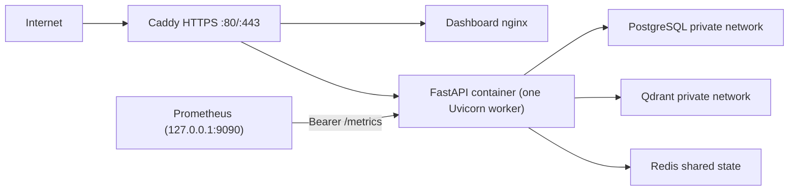

# Production Deployment

> First deployment: see the step-by-step Chinese beginner guide at
> [`server-deployment-guide.zh-CN.md`](./server-deployment-guide.zh-CN.md).

## Target topology

The production baseline is a single Linux host running Docker Compose. It requires no paid infrastructure beyond the host itself and the configured AI API usage.



Only Caddy publishes public host ports. Prometheus binds to `127.0.0.1:9090` for SSH-tunnel access and scrapes the API on an internal Docker network. PostgreSQL, Qdrant, Redis, Dashboard, and the API have no public host bindings. The current production Compose configuration runs one Uvicorn worker in one API container and uses Redis for realtime events, visitor presence, rate limits, chat-capacity leases, model budgets, and knowledge-sync leases. A single host remains a single failure domain. The 30-site target requires at least three one-worker API replicas behind an external load balancer and data services with independent high availability; see [`public-widget-production.md`](./public-widget-production.md).

## Host prerequisites

- A Linux host with Docker Engine and Docker Compose v2
- DNS `A`/`AAAA` record for the support hostname pointing to the host
- Inbound TCP 80 and TCP/UDP 443 allowed
- An email address for ACME certificate notifications
- A real model API key and selected model names

The hostname, server, email, tenant identifier, and model API key are external inputs and may be filled later. WordPress sites and one-time keys are created after sign-in from Dashboard Settings. No real secret is committed to this repository.

## First deployment

```bash
cp .env.production.example .env.production
# Replace every placeholder and use URL encoding in DATABASE_URL when needed.
sh ./scripts/deploy.sh
```

The deployment script performs these gates in order:

1. Render and validate the Compose model.
2. Build immutable application and Dashboard images.
3. Validate production settings inside the built application image.
4. Initialize restricted database roles and run Alembic through the dedicated `migrator` role.
5. Start the private data services, API, Dashboard, and Caddy.
6. Generate the ignored, mode-restricted Prometheus metrics secret and start Prometheus.

Verify:

```bash
docker compose --env-file .env.production -f compose.production.yaml ps
curl --fail https://support.example.com/health/live
curl --fail https://support.example.com/health/ready
curl --fail http://127.0.0.1:9090/-/ready
```

Prometheus is intentionally not exposed through Caddy or the firewall. Access its UI with
`ssh -L 9090:127.0.0.1:9090 <user>@<host>` and open `http://127.0.0.1:9090/targets`.

## First administrator

`BOOTSTRAP_ADMIN_PASSWORD` is a one-time, idempotent break-glass credential. Set `BOOTSTRAP_ADMIN_EMAIL` so the initial tenant owner also receives an email identity; `BOOTSTRAP_PLATFORM_OWNER=true` grants the separate platform owner role. After email login, invitation registration, membership assignment, and workspace switching pass acceptance:

1. Remove `BOOTSTRAP_ADMIN_PASSWORD` from `.env.production`.
2. Set `LEGACY_LOGIN_ENABLED=false` and `BOOTSTRAP_PLATFORM_OWNER=false`.
3. Run `sh ./scripts/deploy.sh` again.
4. Store the break-glass password in an offline password manager and restrict its use by VPN or IP policy.

The bootstrap operation is tenant-scoped and auditable. It does not overwrite an existing administrator.

## Security properties

- `APP_ENV=production` rejects mock authentication, mock data, fake models, insecure administrator cookies, wildcard origins, localhost origins, and non-HTTPS origins.
- Caddy obtains and renews TLS certificates and adds baseline security headers.
- API and migration containers drop Linux capabilities and enable `no-new-privileges`.
- The API root filesystem is read-only with a bounded temporary filesystem.
- PostgreSQL and Qdrant use a Docker-internal network and are not exposed publicly.
- Application secrets live only in `.env.production`, which is ignored by Git.
- The API uses `app_tenant`, which is a non-owner role with `NOBYPASSRLS`; migration credentials are removed from the API container environment.
- `backup_reader` is read-only but has `BYPASSRLS` so it can create complete backups. It must never be used by the API or interactive reporting tools.

See `docs/email-invitation-auth.md` for the primary identity setup, `docs/dingtalk-sso.md` for the optional external provider, and `docs/database-roles-and-rls.md` for role creation, existing-volume upgrades, and RLS acceptance.

## Upgrade

Before upgrading, create both backups described in `docs/backup-and-restore.md`. Then update the source checkout and run:

```bash
sh ./scripts/deploy.sh
```

Alembic migrations must remain backward compatible with the previous application image during the deployment window. For a failed application deployment, restore the previous source/image and rerun the deployment. Database downgrade is not automatic; use a verified backup restore when a migration is not forward-fixable.

## Operations

```bash
# Structured service logs
docker compose --env-file .env.production -f compose.production.yaml logs -f --tail=200

# Restart API only
docker compose --env-file .env.production -f compose.production.yaml restart api

# Inspect Prometheus and API scrape status
docker compose --env-file .env.production -f compose.production.yaml ps prometheus api
docker compose --env-file .env.production -f compose.production.yaml logs --tail=100 prometheus

# Stop without deleting data
docker compose --env-file .env.production -f compose.production.yaml down
```

Never run `down --volumes` in production unless an approved destructive restore or decommission procedure explicitly requires it.

## Windows staging host

Docker Desktop can validate the same production topology before a Linux host is selected:

```powershell
Copy-Item .env.production.example .env.production
pwsh -File scripts/deploy.ps1 -EnvFile .env.production
```

A public Windows deployment still requires the same DNS, firewall, TLS, backup, monitoring, and operator review gates. Linux remains the recommended production target.

## Browser Security Gate

Production requires `ENFORCE_BROWSER_ORIGIN=true`, secure cookies, and an explicit HTTPS `ALLOWED_ORIGINS` entry matching the Dashboard origin. Cookie-authenticated writes and WebSockets fail closed when the Origin is absent or untrusted. Caddy and Dashboard nginx provide CSP, anti-frame, MIME, referrer, permissions, and HSTS policies.

## First-Run Control Plane

After the stack is healthy, sign in as the bootstrap tenant owner, then use Dashboard Settings to:

1. Create support team accounts and assign deterministic roles.
2. Create each WordPress site and copy its one-time site key.
3. Review System Status for PostgreSQL, Qdrant, and Redis health and verify the expected shared-state production configuration.

## Automated acceptance

The Presence capacity, datastore audit, fault-drill, and staged rollout procedure is documented
in [`presence-capacity-runbook.zh-CN.md`](./presence-capacity-runbook.zh-CN.md).

After the deployment is healthy and an administrator exists, run `scripts/launch_acceptance.py` as documented in `docs/operations-readiness.md`. Use `--require-production` for every public release and `--require-current-backups` after the first verified backups. The script is non-destructive and does not call the LLM.

## Retention gate

`RETENTION_EXECUTION_ENABLED` must remain `false` until privacy/legal approval establishes the policy version, durations and legal-hold requirements. Preview is safe to run before approval. Execution requires a tenant, unique run key, trusted operator and human approval reference and writes a transactionally consistent audit event.
# Pre-release gate

Run `powershell -ExecutionPolicy Bypass -File scripts/run_release_gate.ps1 -RunInfrastructure` against an isolated staging database before production deployment. The command deliberately fails when model/retrieval evidence is stale, operational samples are insufficient, or the safety gates do not pass.

Production requires `REDIS_URL` and Prometheus metrics. In-memory presence, rate limits, or realtime state are development-only configurations and are not valid for production multi-tenant use.

When PgBouncer transaction pooling is used, set
`DATABASE_PREPARED_STATEMENT_CACHE_SIZE=0`. Tenant RLS context is set with
transaction-local `set_config(..., true)` on every transaction and must remain enabled. Run the
PostgreSQL RLS integration suite through the PgBouncer endpoint before changing production traffic.
