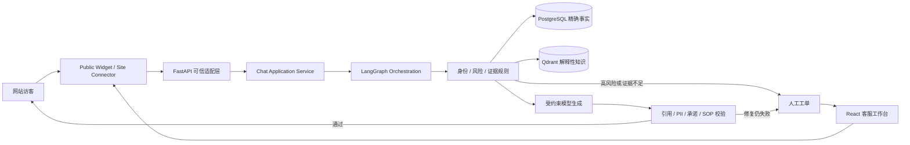

# SupportOS 工程案例

> 更新日期：2026-08-10
>
> 项目形态：公司内部核心项目，个人独立负责需求分析、架构设计、全栈开发、部署与持续维护，已部署于 [LiveChatGo](https://livechatgo.com/)
>
> 业务覆盖：接入约 10 个多品类独立站，按 6 个真实业务工作区管理与隔离，主要服务客服与运营团队
>
> 准入方式：平台管理员签发绑定企业邮箱、有效期和站点额度的一次性开通链接，不开放自由注册

> 公开说明：本仓库为经公司明确授权公开的真实业务项目源码；公开内容不包含真实客户 PII、密钥、
> 私有运营数据或未经脱敏的敏感垂直业务内容。公开示例域名、SKU、商品、政策和 Eval 检索语料均为合成数据。

## 1. 项目定位

SupportOS 是一套面向多租户网站的 AI 客服平台。它不是单独的聊天接口，而是把访客 Widget、
LangGraph 对话运行时、商品与知识系统、人工客服工作台、权限审计和生产运维组合成完整业务闭环。
项目从需求分析、产品建模、架构设计、前后端与 Agent 开发，到部署和持续维护均由我独立负责。

项目最重要的工程目标是：

> 模型负责理解和表达，身份、租户、授权、风险、事实来源、知识发布、引用与人工接管由确定性代码负责。

## 2. 为什么需要这个系统

普通知识库问答在真实客服场景中有四个明显缺口：

1. 向量相似不等于商品、价格、库存和政策事实准确。
2. 用户文本和模型输出不能成为身份、租户或权限依据。
3. 订单、退款、支付和产品安全问题不能只靠 Prompt 控制。
4. AI 无法回答时，需要持久化人工接管，而不是返回一条泛化失败消息后结束。

SupportOS 因此把问题拆成事实治理、知识检索、风险决策、受约束生成、输出验证和人工运营六个部分。

## 3. 系统闭环

## 4. 核心技术决策

### 4.1 PostgreSQL 与 Qdrant 分源治理

商品身份、SKU、价格、库存、尺寸和配送区域属于精确事实，由 PostgreSQL 商品快照管理。FAQ、政策、
说明和购买指南属于解释性内容，由 Qdrant 提供语义与词法混合检索。

精确商品匹配失败时，系统不会拿相似商品向量结果替代。该设计避免了 RAG 在结构化事实问题上的常见
误用，并允许价格、库存和政策采用不同的时效规则。

关键证据：

- `app/application/services/product_catalog.py`
- `app/application/services/knowledge.py`
- `app/integrations/qdrant/adapter.py`
- `docs/product-snapshot-runtime.md`
- `docs/hybrid-retrieval.md`

### 4.2 风险与授权在模型前完成

身份和 `tenant_id` 只来自认证会话、站点凭证或受信适配器。订单、退款、取消、支付、赔偿、隐私与
高风险使用问题在调用模型或业务工具前进入确定性分支。

模型不能降低风险等级，不能选择租户，也不能注册或执行不可逆业务操作。所有写操作需要权限、
幂等键、审计和明确事务边界。

关键证据：

- `app/domain/rules/risk.py`
- `app/domain/rules/order_handoff.py`
- `app/application/services/chat.py`
- `tests/unit/test_risk_rules.py`
- `tests/integration/test_postgres_rls.py`

### 4.3 LangGraph 只负责编排，不成为业务权威

图状态保存有限、可序列化的运行信息，不保存 ORM、SDK 响应、秘密、完整文档或权威业务状态。
节点通过应用服务获取事实和执行副作用，失败分支明确进入追问、降级或人工接管。

关键证据：

- `app/graphs/state.py`
- `app/graphs/builder.py`
- `app/graphs/nodes.py`
- `tests/unit/test_graph.py`
- `tests/unit/test_shared_state.py`

### 4.4 网站知识采用暂存、核对、发布

抓取结果不会直接覆盖在线索引。系统先创建非活动版本与商品快照，完成数量、标识符、Manifest 和
Qdrant 点位核对后再切换发布状态。失败任务保留旧版本，避免一次抓取异常导致线上知识整体消失。

关键证据：

- `app/knowledge/web/sync_service.py`
- `app/knowledge/web/job_worker.py`
- `tests/integration/test_web_staged_publication.py`
- `docs/web-knowledge-operations.md`

### 4.5 AI 与人工客服共享同一会话状态

人工接管不是临时提示，而是 PostgreSQL 中可查询、可分配、可审计的业务状态。会话进入人工队列后，
AI 不会因为新访客消息自动夺回所有权。

客服工作台覆盖 Inbox、Visitors、Tickets、Knowledge、Automation、Customers、Reports 和 Settings，
并通过 REST/WebSocket 与应用服务交互。

## 5. 当前可复现证据

以下结果只描述当前代码基线，不等同于线上业务增长：

| 检查 | 结果 | 复现命令 |
| --- | --- | --- |
| Python 版本 | 3.12.10 | `python --version` |
| Ruff 静态检查 | 通过 | `python -m ruff check .` |
| Ruff 格式检查 | 587 个文件符合格式 | `python -m ruff format --check .` |
| 架构契约 | 6/6 通过 | `python scripts/check_architecture.py` |
| Python 测试 | 默认环境 751 项通过；55 项 PostgreSQL/Qdrant/Redis 集成用例在目标环境执行 | `python -m pytest` |
| Dashboard 测试 | 30/30 通过 | `cd dashboard && npm test` |
| Dashboard 构建 | TypeScript/Vite 生产构建通过 | `cd dashboard && npm run build` |
| 固定离线输出合同回归 | 30/30 案例通过 | `python -m evals.run_production_gate` |

固定离线回归当前在意图、下一步动作、数字支持、引用支持、必需内容、禁止表达、响应限制和跨租户
安全等指标上均为 1.0。该结果来自固定离线案例，不应表述为真实用户准确率。

## 6. 不应夸大的边界

- 默认测试基线与 PostgreSQL、Qdrant、Redis 集成用例分开描述；基础设施用例必须在目标环境或 CI infrastructure job 中启用。
- 历史检索与真实模型原始运行结果已移出公开源码树；只有绑定当前 commit、数据集和目标环境的脱敏报告才能作为发布证据。
- Recall@10、真实模型承诺率、P95 延迟、自动解决率和 CSAT 必须在目标环境绑定 commit 与数据集重新运行。
- 当前生产部署是受控单机基线，不等于多地域、多副本、高可用平台。
- 系统不自动执行退款、取消、支付、地址修改、赔偿或隐私删除。

这些边界不是项目缺陷的掩饰，而是生产 Agent 必须具备的停止条件和证据纪律。

## 7. 项目差异化

相较于常见 Agent Demo，SupportOS 的差异化不在于框架数量，而在于：

1. 把精确事实与语义知识分开治理。
2. 将身份、权限、租户和风险放在模型之外。
3. 对模型输出执行二次确定性验证。
4. 将人工接管建模为持久化业务流程。
5. 让知识发布、测试、评测、迁移和部署形成可执行门禁。
6. 同时覆盖访客端、Agent Runtime、客服工作台与站点连接器。

## 8. 工程结论

> 我没有把目标定义成让模型尽量多回答，而是先定义哪些事实可以信、哪些动作不能做、失败时如何
> 停止以及人工如何接管，再把模型放入这个边界中。这个项目体现的是 Agent 系统工程能力，而不仅是
> Prompt 或框架调用能力。
